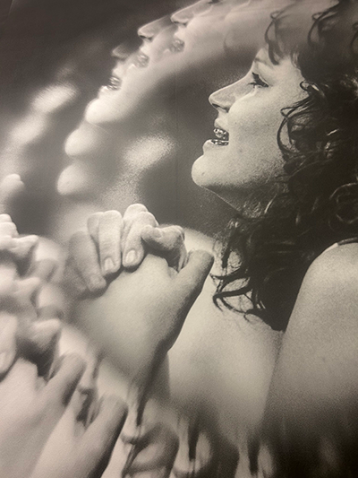
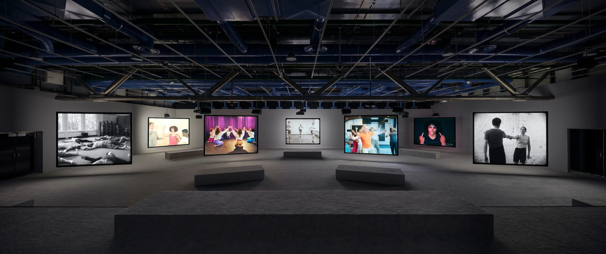
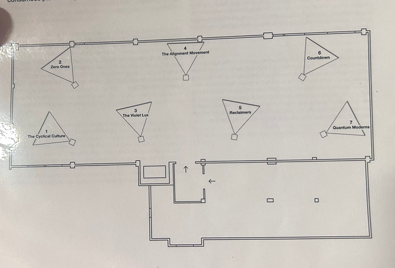
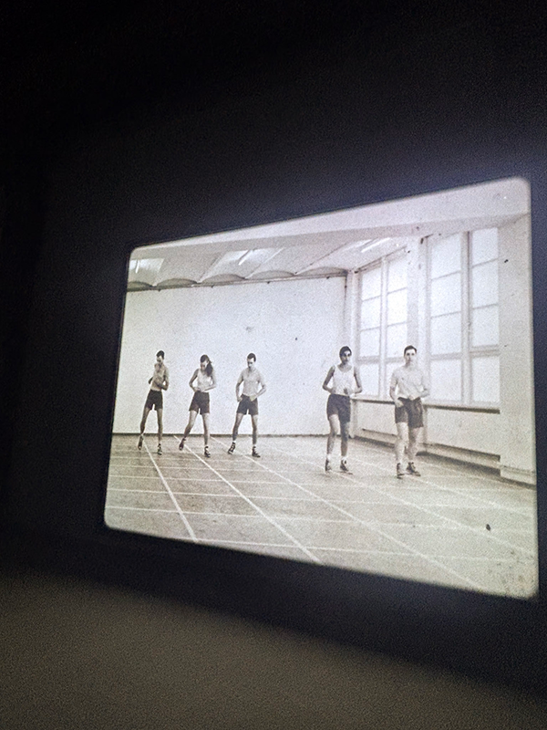
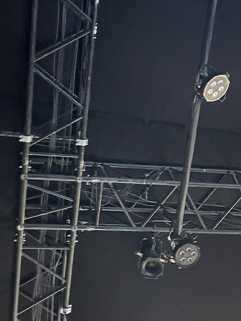
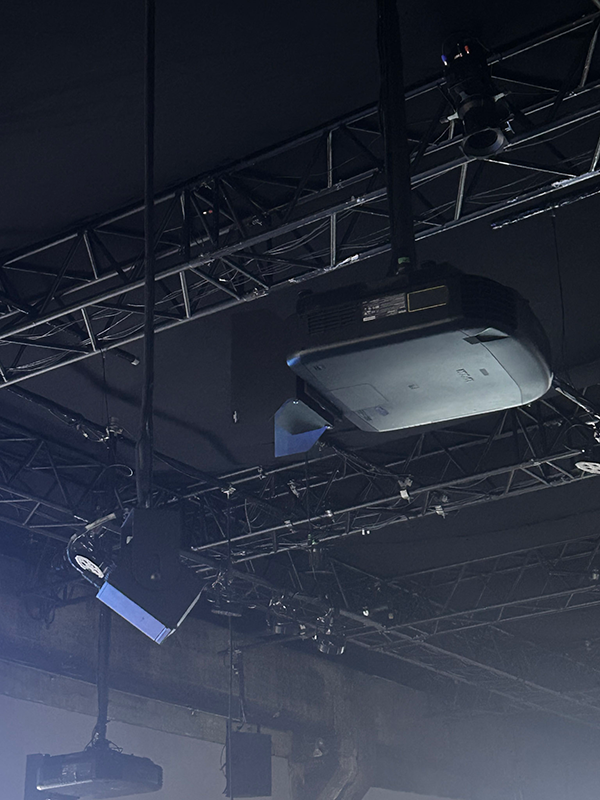
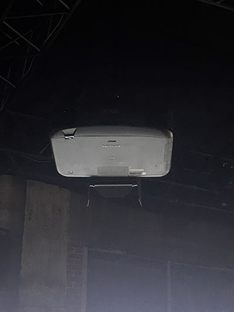
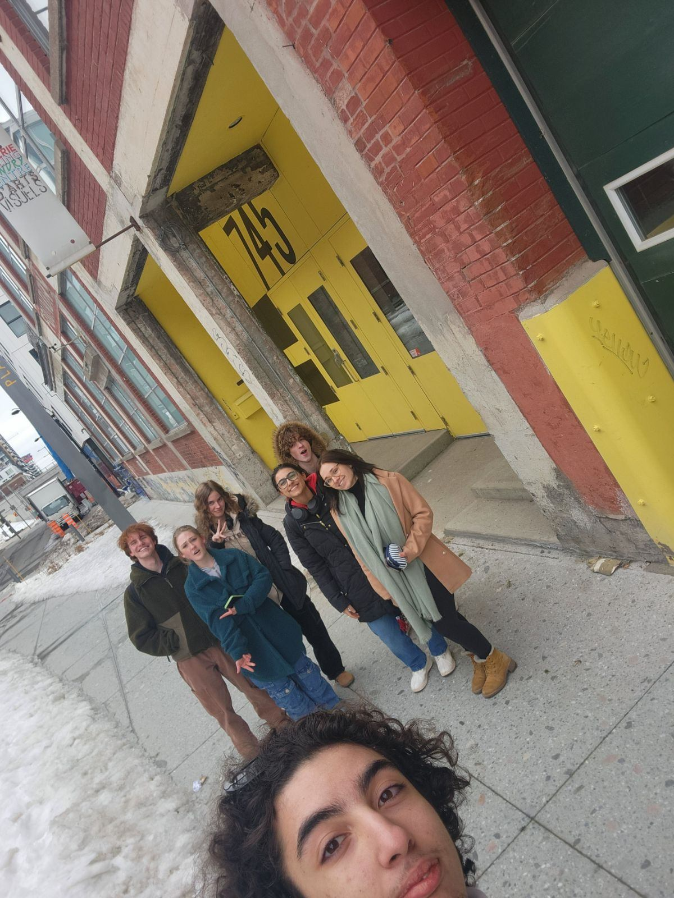

<h1> 
La Fonderie, oeuvre de Jeremy Shaw/Phase Shifthing Index
Réalisé en 2020.
</h1>
 
<h2>
  Adresse: 745 Rue Ottawa, Montréal QC H3C 1R8 
</h2>

 

<h4>
La première partie de la salle:
Elle est visible a l'entrer directement.
  

</h4>

<h4>
La salle est encadré de trois murs remplis d'images monochrome avec une illusion. 
Elles sont tous triplées et tous décalées l'une des autre pour créer un effet 
noptique qui représente l'effet secondaire de la drogue ou du moins addiction sur le corps humain.
La répétition de cette élément sur chaque image est important, parce qu'elle démontre que ce n'est pas que les substance illiscites 
qui entraine un humain en transe et qui perd le controle de son corps.
Voici un exemple d'une image:
</h4>

En rentrant dans la fameuse salle, je remarque qu'elle est vaste. Elle est enrobée de tapis gris confortable et
de plusieurs bancs positionnés devant chaque station de cours-métrage. De plus, un banc supplémentaire est accoté sur le mur principale
pour laisser place à une ensemble de l'oeuvre entière.

lien de l'image: https://macm.org/expositions/jeremy-shaw/:
pris sur le site web directement

Les quatres phases:

La première phase, sur chaque station, il y avait de similitude, ils comprennaient tous des gens qui interpretaient des mouvement sois sacadés ou plus fluide.
Pour chacune, c'était définit dans différente époque et plusieurs styles de danses.

La deuxieme, un évenement inattendu ce produit,le volume augmente de plus en plus pour faire monter la tension et les lumières commencent a clignoté et me procure un intense stresse d'un coup.
Je me sentais débouseler et instable.Les cours vidéos se diffusent en même temps.

La troisième, le tempo ralenti et les images se décomposent en pixel et elles interchagent l'une avec les autres. Elles donnent un effet psychadélique.

La quatrième,  Je me sens plus apaisée et calme. Mes muscles se relachent et se détendent. Un fond d'écran animé apparait sur chaque toile. Les couleurs mixées me procuraient un sentiment de calme.
Elles n'étaient pas saturées, seulement douces et plus foncés. Le rose, le bleu et le mauve mélangées ensemble et la fluidité du mouvement affecte le cerveau, mais de la bonne facon.

Jeremy Shaw a utilisé plusieurs outils pour son oeuvre dont des projecteurs. Il y en avait sur chaque écran, c'est-à-dire sept écrans totals.
Les fils sont protégés par des tuyaux de métal au plafond. De plus, on y retrouve des projection de lumière pour donner une meilleur expérience et 
y rajouter de la couleur. 

J'ai vécu beaucoup d'épreuves émouvantes, du stress, des émotions et une perte de controle parce que je rentrait un peu en transe a cause 
du choix de musique sychronisée aux vidéos.

