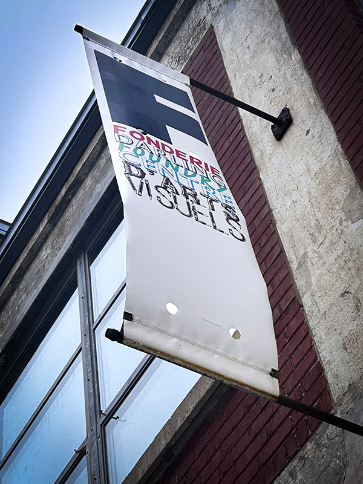
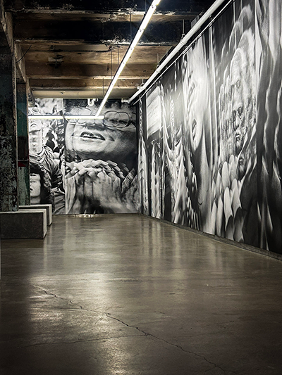

<h1> 
La Fonderie, oeuvre de Jeremy Shaw
</h1>
 
<h2>
  Adresse: 745 Rue Ottawa, Montréal QC H3C 1R8 
</h2>

 

<h3>
À l'accueil, les employées mous accueillent chaleureusement. Elles demandent de faire un choix,
soi garder nos chaussure, 
mais les protéger d'une semelle supplémentaire qui est fourni, soi les enlever.
Je décide donc, de les retirer pour créer un meilleur confort. 
   

Pendant l'attente, j'analyse au loin les trois murs monochromes au fond de la salle séparée par une porte ouverte.
Il ya des photos avec un effet de décalage entre eux.

</h3>
