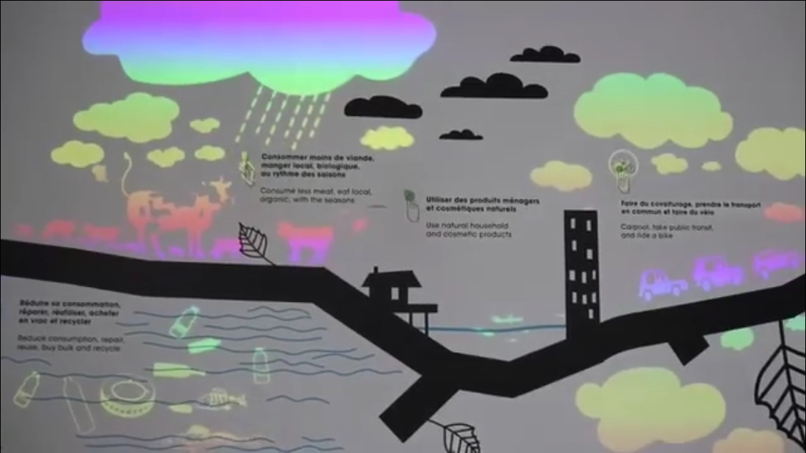

<h2>Armand-Frappier</h2>

<h3>source:emmanuelle mimeault-dumont</h3>

## informations

<li>type d'exposition:intérieur</li>
<li>date de visite:7 Mars 2024</li>
<li>type d'installation:interactive</li>

# partie 1

<h5>À l'entrer, nous pouvions voir deux salles séparées au loin. La première décrivais principalement la digestion de l'estomac d'un etre humain. Ils disposaientt de plusieurs dispositifs multimédia. Des jeux intéractifs ou auditifs qui attiraient beaucoup les enfants avec leur parent. De plus, l'animation prennait du sens quand nous appuyons sur un bouton avec un texte explicatif sur le coté.Un en particulier accrochait le regard plus que les autres.</h5>

<h5>Ceci explique les procédures d'un bon entretien d'agriculture. Les bonnes réponses sont différenciées par le poid de l'objet.Par exemple, si nous mettons la fermette sur la balance et que ce n'est pas la bonne réponse.La machine va refuser et indiquera automatiquement un x. Par contre, nous ne pouvons pas deviner le poid juste avec le visuel donc pour nous aider nous regardons les instructions mentionnés sur l'écran en face de nous.Par la suite, des petites animations donnent vies au jeu et cela rend l'ambiance plus agréable, malgré les mauvaises réponses accumulées.</h5>

# Partie 2

<h4>contexte</h4>
<h5>Pour Armand-Fabbien, il est important pour eux d'etre en bonne santé. De plus,il faut prendre soin de notre corps,mais pur en prendre soin, il faut connaitre ses composantes et comprendre pourquoi est-ce important de boire deux litres d'eau par exemple.Tous les questions les plus demandées seront réponduent par des illustrations animées.</h5>

## Le système nerveux

<h5>Ils sont divisés la salle en étapes.L'une parlant du système nerveux.Sur le mur, ils disposaient de plusieurs boutons. Quand nous appuyons, nous remarquons des petites boules illuminées qui passent atravers le corps pour identifier les cellules nerveuses en déplacement.
Chaque bouton avait une situation propre a eux pour mieux comprendre. Par exemple, il est écrit à droite en bas du bras "Au ralenti quand on dort, rapide quand on court, le coeur ne bats pas toujours au meme rythme cardiaque ! Le bulbe rachidien régule le rythme cardiaque ainsi que d'autres fonctions de survie du corps humain." , donc en appuyant, il démontre le battement de coeur pendant que nos dormons.
</h5>
 

## Échelle des individus

<h5>Parlant des systèmes qui composent le corps humain, l'importance de chaque composante et leur fonction.</h5>

## L'extraction urinaire

<h5>Ils expliquent l'importance de boire un deux litres d'eau par jour pour extraire les mauvais déchets du corps.E pessant sur le petit bouton gris à gauche, nous pouvions remarquer un liquide part du reins qui descend à l'uretère jusqu'à la vessie en se filtrant.</h5>

## La fécondation

<h5>Ils expliquent la création du foetus pendant la pénétration.Dans le ventre,il ne fait que montrer les spermatozoides qui se déplace jusqu'aux ovules.</h5>

## Transformation digestif

<h5>Décrivant le chemin de la nourriture de la bouche jusqu'à l'intestin</h5>

## informations autres

<h3>source:emmanuelle mimeault-dumont</h3>

## Equipements

<li>2 projecteurs au plafond</li>

<h3>source:emmanuelle mimeault-dumont</h3>

<li>2 lumieres au plafond</li>

<h3>source:emmanuelle mimeault-dumont</h3>

<h5>Cette animation murale fonctionne par projection.Elle suggere des options pour devenir plus ecologique a longterme. Quand nous pessons sur un element allume sur le mur, une autre animation suivais.</h5>

<h3>source:emmanuelle mimeault-dumont</h3>

