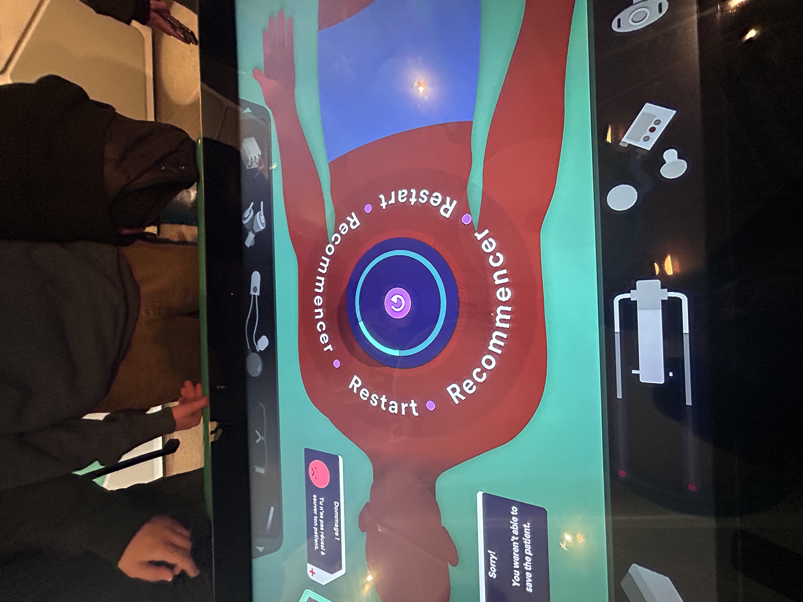

<h2>Centre des sciences</h2>
<h3>Exposition d'une opération intérative</h3>

<h3>source:emmanuelle mimeault-dumont</h3>

## Information

<li>type d'exposition:intérieur</li>
<li>date de visite: 5 Avril 2024</li>

## Contexte

<h4>Une table intéractive qui affiche un humain sur une table d'opération. Il a disposition des outils pour la chirurgie qui se défilent avec un bouton.Pour chaque étape, il y a un minuteur pour créer le stresse ressenti pendant une opération. Un battement de coeurs se fait entendre, ils augmentent à chaque fois qu'une partie de l'opération est ratée.</h4>

<h3>source:emmanuelle mimeault-dumont</h3>

<h3>source:emmanuelle mimeault-dumont</h3>

<h3>Pendant la chirguie, au contacte de la table, le doight va diriger l'outil vers l'endroit ou la personne veux faire l'action.Par exemple, s'il est demander de faire une insition au torasque, nous allons faire glisser le doight directement vers le torasque et faire une ligne pour la coupure.</h3>

<h3>source:emmanuelle mimeault-dumont</h3>

<h4>L'option language est meme la disposition pour les participants.Cela attire plus de personnes a venir l'essayer.</h4>
 
<h3>Expérience</h3>

<h4>Personnellement, j'ai beaucoup aimé essayer de trouver des solutions sur le moment et de devoir utiliser ma logique pour procéder la chirurgie.De plus, meme si nous pouvions penser qu cest trop difficle pur des enfants, il y avait devant eux les réponses d'afficher sur une des pancartes avec l'outil a choisir.</h4>

<h3>Commentaire</h3>

<h4>Personnellement, je n'ai pas beaucoup de commentaires ou de descriptions a dire,malheureusement, parce que le guide qui nous accompagnais ne donnais pas beaucoup d'informations.J'ai donc de la difficulter a decrire se jeu et a bien detailler les composantes.De plus, il y a plusieurs graffines sur la vitre donc si le curseur passais par dessus le défault la connexion coupais et nous ne pouvions plus continuer le jeux.</h4>

